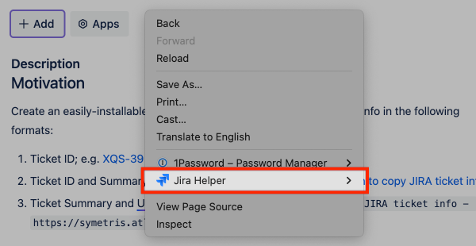

# Jira Helper (Chrome Extension)

A Chrome Extension that makes small enhancements to your JIRA experience.

## Installation

- Visit the [releases page](https://www.github.com/jigarius/jira-helper-crx/releases)
  on the `jigarius/jira-helper-crx` repository on GitHub.
- Download the `.crx` file associated to latest release.
- Visit the <chrome://extensions> page in your [Chromium](https://en.wikipedia.org/wiki/Chromium_(web_browser))-powered browser.
  - If you can't open the page, your browser doesn't support this extension.
- Enable _Developer mode_.
  - This is required because this extension is not available on the Chrome
    Extensions Marketplace.
- Drag and drop the downloaded `.crx` file into the `chrome://extensions` tab.
- If there is a security-related warning, approve the plugin.
- All set! The extension is now installed.
- Following similar steps, you can update the extension in the future.

## Context menu

The extension adds context menu items on JIRA ticket pages.

## Development

- All suggestions and bug reports go to the [issue queue on GitHub](https://www.github.com/jigarius/jira-helper-crx/issues).
- During development, use the _load unpacked extension_ feature to load the
  directory containing the plugin's source code.
- To release a new version,
  - Update the `version` string in `manifest.json`.
  - Push a version tag, e.g. `v0.5.0`.
  - Execute `./scripts/pack.sh` to create a `.crx` file.
  - Create a release on GitHub with the version tag.
  - Attach the packed extension (`.crx`) to the release.

## Acknowledgements

This Chrome Extension was created with ❤️ by [Jigarius](https://jigarius.com/about).
